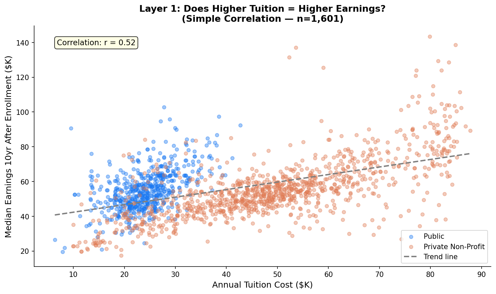
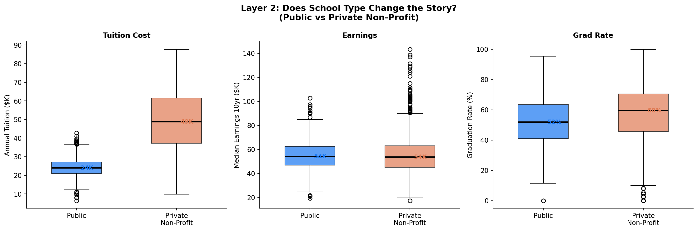
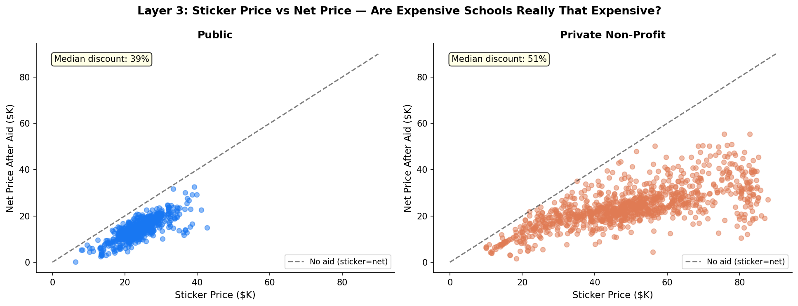
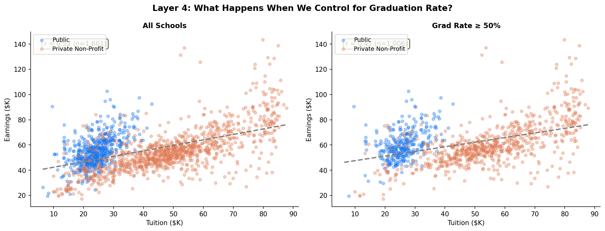
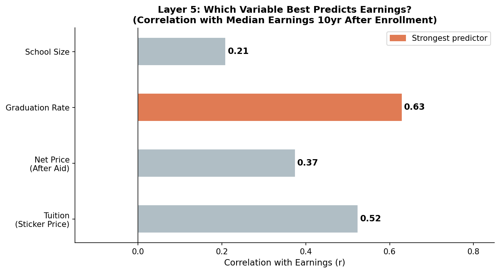

# Does Paying More for College Lead to Higher Earnings?
### U.S. College ROI Analysis — College Scorecard Data (2025)

---

## Project Overview

This project analyzes whether tuition cost predicts earnings after graduation — and shows how the answer changes completely depending on how you process the data.

- **Data Source:** U.S. Department of Education — College Scorecard (2025) — https://collegescorecard.ed.gov/data/
- **Schools analyzed:** 1,601 four-year colleges (Public & Private Non-Profit)
- **Key variables:** Tuition, Net Price After Aid, Graduation Rate, Median Earnings 10 Years After Enrollment

> Note: This project does not establish causation. It demonstrates how variable selection and filtering decisions change the interpretation of the same dataset.
---

## The Question

> **Does paying more for college lead to higher earnings after graduation?**

At first glance, the answer seems obvious — expensive schools produce high earners. But the conclusion changes at every step of data processing. This project documents that journey across 5 layers of analysis.

---

## Data Cleaning Process

```
Raw data: 6,429 institutions
↓ Filter: 4-year degree programs only (PREDDEG == 3)
↓ Filter: Public (1) and Private Non-Profit (2) only
  — Removed for-profit schools (trade/vocational, not comparable)
↓ Remove rows missing tuition, earnings, or graduation rate
↓ Remove 'PrivacySuppressed' values (privacy-masked entries)
↓
Final dataset: 1,601 schools
  (Public: 566 / Private Non-Profit: 1,035)
```

The cleaning decisions themselves shape the analysis — keeping for-profit schools, for example, would have significantly distorted the results.

---

## 5 Layers of Analysis

### Layer 1: Simple Correlation — Tuition vs Earnings

The most basic question: does higher tuition correlate with higher earnings?

> **r = 0.52** — A moderate positive correlation. Expensive schools do tend to produce higher earners, but the relationship is far from clean.



---

### Layer 2: Does School Type Change the Story?

Splitting by Public vs Private Non-Profit reveals a key nuance.

- Private schools charge significantly more in tuition
- But median earnings are only marginally higher
- Public schools show a **better ROI** when comparing tuition paid vs earnings gained



---

### Layer 3: Sticker Price vs Net Price — Are Expensive Schools Really That Expensive?

Tuition listed on a school's website (sticker price) is not what most students actually pay.

- **Private Non-Profit schools** offer a median discount of ~40% through financial aid
- A school with $60K sticker price may actually cost $35K after aid
- When recalculated using net price, the correlation with earnings **drops from r = 0.52 to r = 0.37**

> Expensive-looking schools aren't always actually expensive — and cheap-looking schools aren't always cheap.



---

### Layer 4: What Happens When We Control for Graduation Rate?

Schools with low graduation rates skew the earnings data — students who don't graduate still show up in the enrollment figures but their lower earnings aren't captured.

- Filtering for schools with graduation rate ≥ 50% changes the correlation
- The relationship between tuition and earnings becomes **cleaner and stronger**
- This suggests that graduation rates are a confounding variable in the raw analysis



---

### Layer 5: Which Variable Actually Predicts Earnings Best?

After running through all four layers, comparing the correlation of each variable with earnings reveals the real answer.

| Variable | Correlation with Earnings |
|---|---|
| Graduation Rate | **r = 0.63** ← strongest |
| Tuition (Sticker) | r = 0.52 |
| Net Price (After Aid) | r = 0.37 |
| School Size | weak |

> **The variable that best predicts earnings is not tuition — it's graduation rate.**  
> Schools that get students across the finish line produce higher earners, regardless of price.



---

## Key Takeaway

Starting with "does expensive = better earnings?" leads to a misleading r = 0.52.

But after controlling for school type, financial aid, and graduation rate, a clearer picture emerges:

**It's not about how much you pay. It's about whether you graduate — and from what kind of institution.**

---

## Tools Used

- **Python** — pandas, numpy, matplotlib, seaborn
- **Data** — U.S. Department of Education, College Scorecard (collegescorecard.ed.gov)

---

## Files

```
├── README.md
├── analysis.py
├── college_data.csv
└── figures/
    ├── fig1_tuition_vs_earnings.png
    ├── fig2_public_vs_private.png
    ├── fig3_sticker_vs_net_price.png
    ├── fig4_grad_rate_effect.png
    └── fig5_summary.png
```

---

## Reflection

This project highlights that the most valuable part of data analysis is not only visualization, but the ability to ask the right questions and design meaningful experiments. The same dataset produced four different answers depending on how it was processed — and each processing decision had a justifiable reason behind it. That's what makes data analysis interesting: the answer is never just in the numbers, it's in the choices you make about how to look at them.
